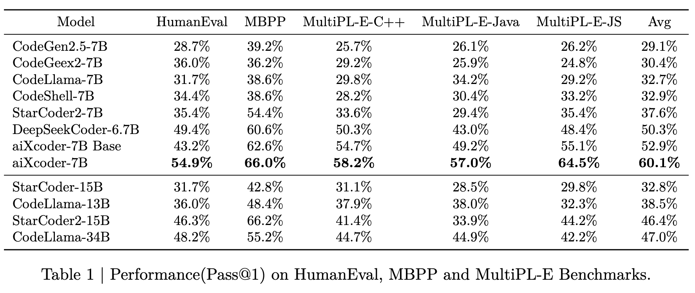
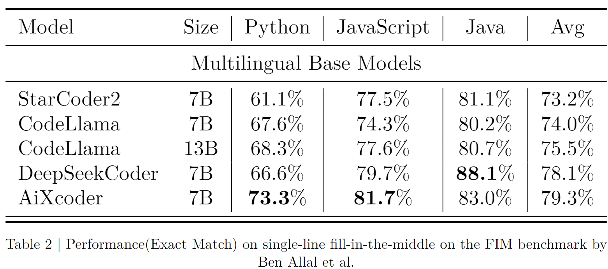
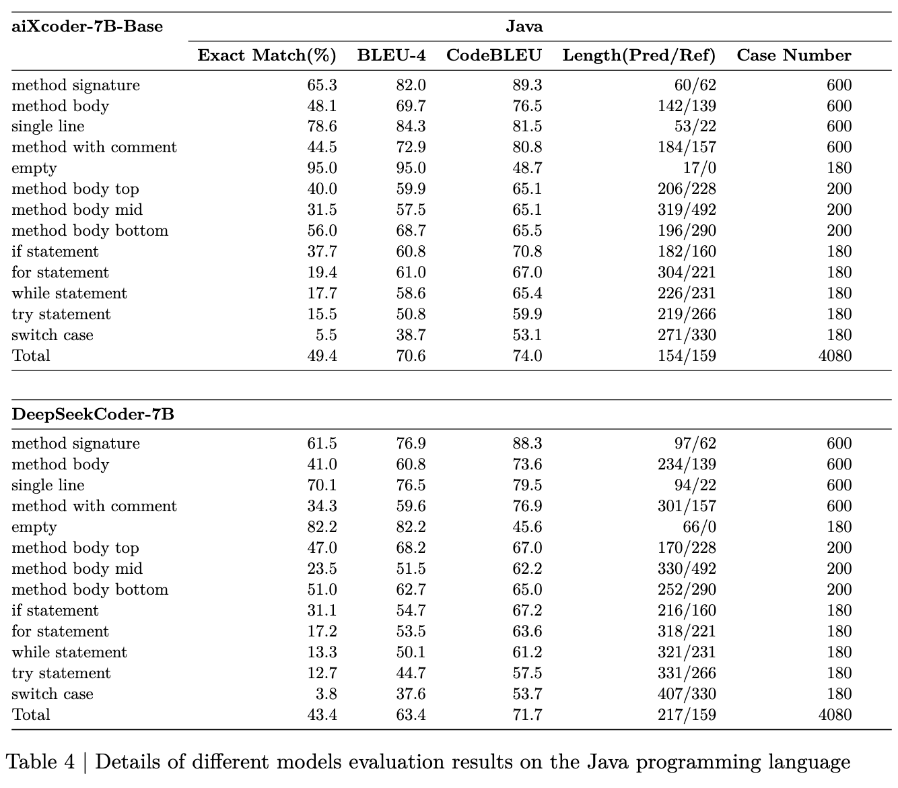
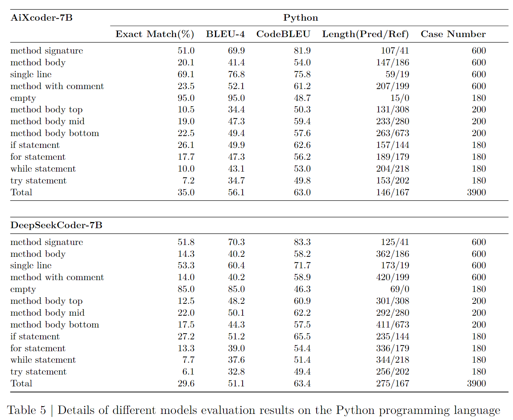
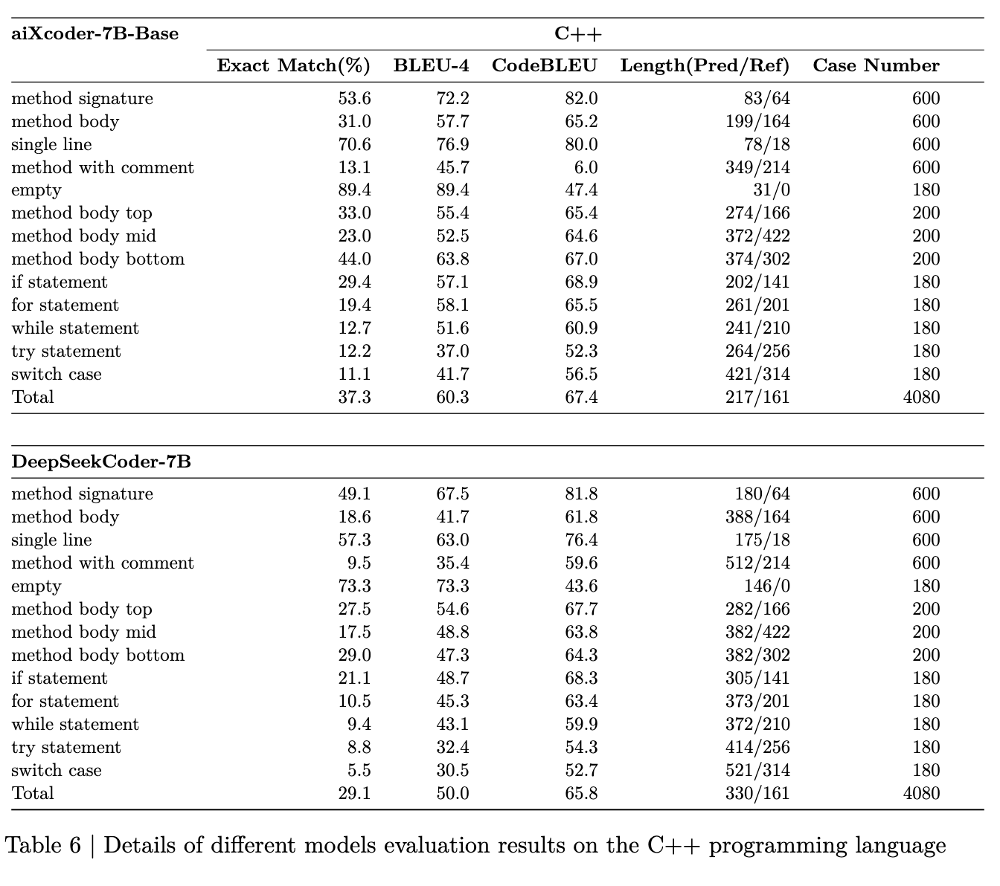
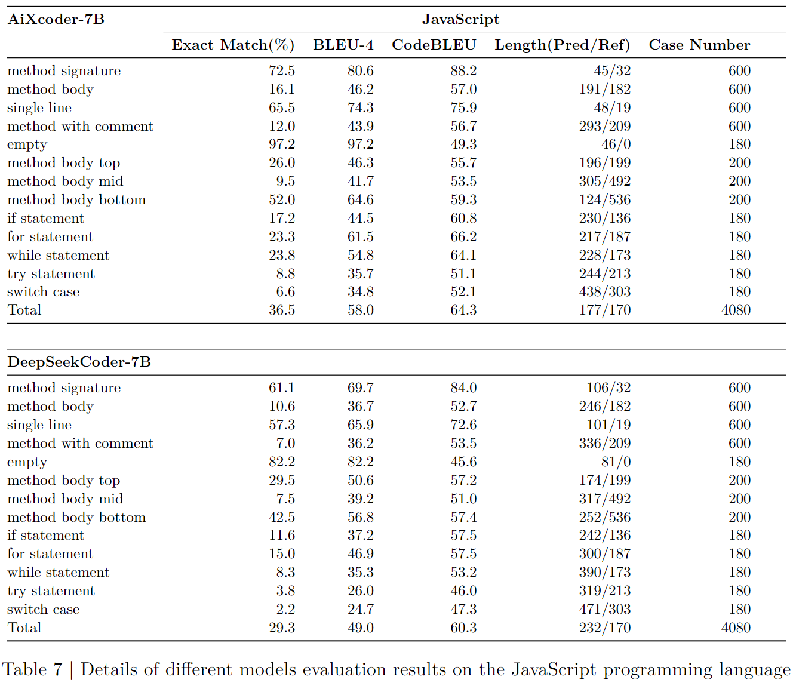
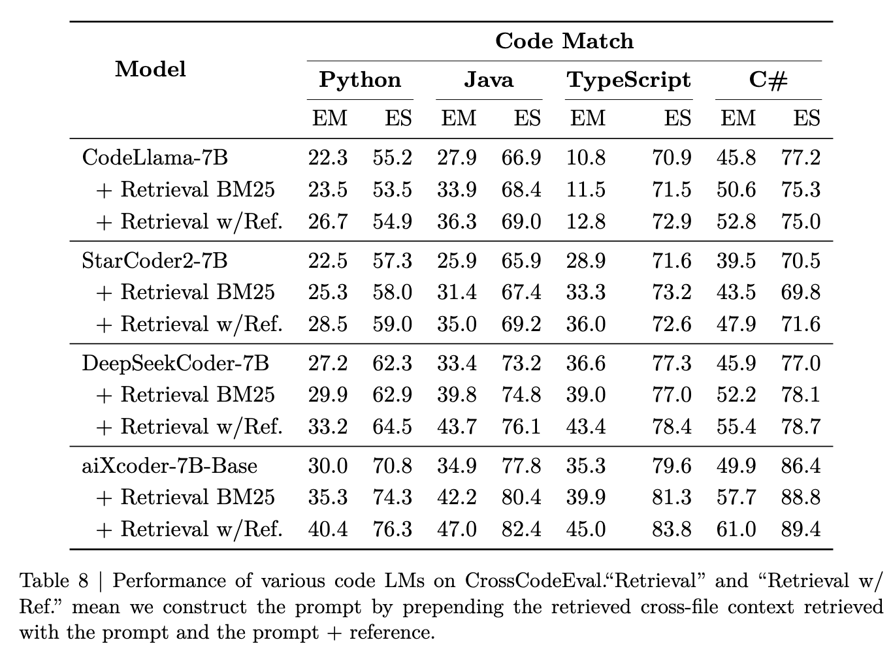

# aiXcoder-7B Code Large Language Model

<p align="center">
    🏠 <a href="https://www.aixcoder.com/" target="_blank">Official website</a>｜🛠 <a href="https://marketplace.visualstudio.com/items?itemName=aixcoder-plugin.aixcoder" target="_blank">VS Code Plugin</a>｜🛠 <a href="https://plugins.jetbrains.com/plugin/13574-aixcoder-code-completer" target="_blank">Jetbrains Plugin</a>｜🤗 <a href="https://huggingface.co/aiXcoder/aixcoder-7b-base" target="_blank">Model Weights</a>｜<a href="./assets/wechat_1.jpg" target="_blank">WeChat</a>｜<a href="./assets/wechat_2.jpg" target="_blank">WeChat Official Account</a>
</p>

Welcome to the official repository of aiXcoder-7B Code Large Language Model. This model is designed to understand and generate code across multiple programming languages, offering state-of-the-art performance in code completion, comprehension, generation, and more tasks about programming languages.

Table of Contents

1. [Model Introduction](#model-introduction)
2. [Quickstart](#quickstart)
    - [Environment Requirements](#environment-requirements)
    - [Model Weights](#model-weights)
    - [Inference Example](#inference-example)
3. [Data for aiXcoder 7B](#data-for-aixcoder-7b)
4. [Training](#training)
    - [Training Hyperparameters](#training-hyperparameters)
    <!-- - [Batch processing method](#batch-processing-method)
    - [Pre-training Tasks](#pre-training-tasks) -->
5. [Details of Experimental Results](#details-of-experimental-results)
    - [NL2Code Benchmarks](#nl2code-benchmarks)
    - [Code Completion (Fill in the Middle)](#code-completion-fill-in-the-middle)
    - [Cross-file Code Evaluation](#cross-file-code-evaluation)
6. [License](#license)
7. [Acknowledgments](#acknowledgments)


## Model Introduction

As the capabilities of large code models are gradually being unearthed, aiXcoder has consistently pondered on how to make these models more beneficial in real development scenarios. To this end, we have open-sourced aiXcoder 7B Base, which has undergone extensive training on 1.2T Unique Tokens, and the model's pre-training tasks as well as the contextual information have been uniquely designed for real-world code generation contexts.

aiXcoder 7B Base stands out as the most effective model in code completion scenarios among all models of similar parameter sizes, and it also surpasses mainstream models like codellama 34B and StarCoder2 15B in the average performance on the multilingual nl2code benchmark.

In our ongoing exploration to apply large code models, the release of aiXcoder 7B Base represents a significant milestone. The current version of aiXcoder 7B Base is a foundational model that focuses on improving the efficiency and accuracy of code completion and code generation tasks, aiming to provide robust support for developers in these scenarios. It is important to note that this version has not undergone specific instruct-tuning, which means it might not yet offer optimal performance for specialized higher-level tasks such as test case generation and code debugging.

However, we have plans for further development of the aiXcoder model series already in motion. In the near future, we aim to release new versions of the model that have been meticulously instruct-tuned for a wider range of programming tasks, including but not limited to test case generation and code debugging. Through these instruct-tuned models, we anticipate offering developers more comprehensive and deeper programming support, helping them to maximize efficiency at every stage of software development.


> aiXcoder 7B surpasses mainstream models in nl2code benchmark. aiXcoder-7B is an enhancement of aiXcoder-7B-Base, fine-tuned on one hundred thousand data entries similar to Evol-instruct for one epoch.

<br>
<br>


> aiXcoder 7B Base surpasses mainstream models in code completion scenarios.

<br>
<br>

## Quickstart

### Environment Requirements

#### Option 1: Build Env

To run the model inference code, you'll need the following environment setup:

- Python 3.8 or higher
- PyTorch 2.1.0 or higher
- sentencepiece 0.2.0 or higher
- transformers 4.34.1 or higher (if run inference by transformers library)

Please ensure all dependencies are installed using the following command:

```bash
conda create -n aixcoder-7b python=3.11
conda activate aixcoder-7b
git clone git@github.com:aixcoder-plugin/aiXcoder-7b.git
cd aiXcoder-7b
pip install -r requirements.txt
```

`requirements.txt` listed all necessary libraries and their versions.

To achieve faster inference speeds, especially for large models, we recommend installing `flash attention`. `Flash attention` is an optimized attention mechanism that significantly reduces computation time for transformer-based models without sacrificing accuracy.

Before proceeding, ensure your environment meets the CUDA requirements as `flash attention` leverages GPU acceleration. Follow these steps to install `flash attention`:

```bash
git clone git@github.com:Dao-AILab/flash-attention.git
cd flash-attention
MAX_JOBS=8 python setup.py install
```

#### Option 2: Docker

For a consistent and isolated environment, we recommend running the model inference code using Docker. Here's how to set up and use Docker for our model:

1. Install Docker: If you haven't already, install Docker on your machine.

2. Pull the Docker Image: Pull the Docker image from Docker Hub.

```bash
docker pull pytorch/pytorch:2.1.0-cuda11.8-cudnn8-devel
```

3. Run the Container: Once the image is pulled, you can run the model inside a Docker container.

```bash
docker run --gpus all -it -v /dev/shm:/dev/shm --name aix_instance pytorch/pytorch:2.1.0-cuda11.8-cudnn8-devel /bin/bash
pip install sentencepiece
git clone git@github.com:aixcoder-plugin/aiXcoder-7b.git
cd aiXcoder-7b
```

This command starts a container named aix_instance from the pytorch image. You can interact with the model inside this container.

To achieve faster inference speeds, especially for large models, we recommend installing `flash attention`. 

```bash
git clone git@github.com:Dao-AILab/flash-attention.git
cd flash-attention
MAX_JOBS=8 python setup.py install
```

4. Model Inference: Within the Docker container, you can run the model inference code as described in the Inference Example section.

Using Docker provides a clean, controlled environment that minimizes issues related to software versions and dependencies.

### Model Weights

You can download the model weights from the following link: 

- [aiXcoder Base Download](https://huggingface.co/aiXcoder/aixcoder-7b-base)
- aiXcoder Instruct Download (Comming soon...)

### Inference Example

#### Command Line Execution

For a quick start, you can run the model inference directly from the command line:

```bash
torchrun --nproc_per_node 1 sess_megatron.py --model_dir "path/to/model_weights_dir"
```

Replace "path/to/model_weights_dir" with the actual path to your downloaded model weights.


or run inference with huggingface's transformers：

```bash
python sess_huggingface.py
```

#### Python Script Execution

Alternatively, you can invoke the model programmatically within your Python scripts. This method provides more flexibility for integrating the model into your applications or workflows. Here's a simple example on how to do it:

```python

from sess_megatron import TestInference

infer = TestInference()
res = infer.run_infer(
    # for FIM style input, code_string stands for prefix context
    code_string="""# 快速排序算法""", 
    # for FIM style input, later_code stands for suffix context
    later_code="\n",
    # file_path should be a path from project to file
    file_path="test.py",
    # max num for generated tokens
    max_new_tokens=256,
)
print(res)

"""output:

def quick_sort(arr):
    if len(arr) <= 1:
        return arr
    pivot = arr[0]
    less = [i for i in arr[1:] if i <= pivot]
    greater = [i for i in arr[1:] if i > pivot]
    return quick_sort(less) + [pivot] + quick_sort(greater)


# 测试
arr = [3, 2, 1, 4, 5]
print(quick_sort(arr))  # [1, 2, 3, 4, 5]
"""

```

```python


import torch
import sys
from hf_mini.utils import input_wrapper
from transformers import AutoModelForCausalLM, AutoTokenizer

device = "cuda" # the device to load the model onto

tokenizer = AutoTokenizer.from_pretrained("aiXcoder/aixcoder-7b-base")
model = AutoModelForCausalLM.from_pretrained("aiXcoder/aixcoder-7b-base", torch_dtype=torch.bfloat16)


text = input_wrapper(
    # for FIM style input, code_string stands for prefix context
    code_string="# 快速排序算法",
    # for FIM style input, later_code stands for suffix context
    later_code="\n# 测试\narr = [3, 2, 1, 4, 5]\nprint(quick_sort(arr))  # [1, 2, 3, 4, 5]",
    # file_path should be a path from project to file
    path="test.py"
)

if len(text) == 0:
    sys.exit()

inputs = tokenizer(text, return_tensors="pt", return_token_type_ids=False)

inputs = inputs.to(device)
model.to(device)

outputs = model.generate(**inputs, max_new_tokens=256)
print(tokenizer.decode(outputs[0], skip_special_tokens=False))


"""output:
def quick_sort(arr):
    # 如果数组长度小于等于1，直接返回
    if len(arr) <= 1:
        return arr
    # 选择数组的第一个元素作为基准
    pivot = arr[0]
    # 初始化左右指针
    left, right = 1, len(arr) - 1
    # 循环直到左指针小于右指针
    while left < right:
        # 从右到左找到第一个小于基准的元素，与左指针元素交换
        if arr[right] < pivot:
            arr[left], arr[right] = arr[right], arr[left]
            left += 1
        # 从左到右找到第一个大于等于基准的元素，与右指针元素交换
        if arr[left] >= pivot:
            right -= 1
    # 将基准元素与左指针元素交换
    arr[left], arr[0] = arr[0], arr[left]
    # 对左半部分进行递归排序
    quick_sort(arr[:left])
    # 对右半部分进行递归排序
    quick_sort(arr[left + 1:])
    return arr</s>
"""

```


## Data for aiXcoder 7B

The data for aiXcoder is divided into a core dataset and an extended dataset. The core dataset comprises the programming languages commonly used in development, as well as natural languages closely related to code. The core dataset's programming languages mainly include nearly a hundred mainstream languages such as C++, Python, Java, and JavaScript, while the natural language component primarily consists of StackOverflow Q&As, technical blogs, code documentation, and computer science papers. The extended data mainly consists of filtered open-source code datasets, high-quality English natural language datasets, and high-quality Chinese natural language datasets.

<!-- <br>
<br>


<br>
<br> -->


The aiXcoder core dataset is mainly used to enhance the performance of the large code model in the aforementioned programming languages, undergoing a rigorous filtering and selection process. Specifically, this process includes the following steps: 1) Selection of raw data; 2) Comprehensive ranking and selection of projects; 3) Code deduplication and the removal of automatically generated code using methods such as MinHashes (Broder, 2000); 4) Identification and handling of personal sensitive information; 5) Cleaning of commented code; 6) Syntactic analysis to filter incorrect or anomalous code files; 7) Static analysis to detect and eliminate 163 types of high-risk bugs and 197 types of defects in mainstream programming languages such as Java, C++, Python, and JavaScript.

1. Raw Data Selection
    - Exclude projects under copyleft licenses.
    - Deduplicate projects gathered from various code hosting platforms and open-source datasets
2. Project-Level Comprehensive Ranking
    - Calculate project metrics, including the number of Stars, Git Commit counts, and the quantity of Test files.
    - Exclude the lowest 10% of data based on a comprehensive score.
3. Code File-Level Filtering
    - Remove automatically generated code.
    - Employ near-deduplication for redundancy removal.
4. Sensitive Information Removal
    - Use named entity recognition models to identify and delete sensitive information such as names, IP addresses, account passwords, and URLs.
5. Commented Code
    - Randomly deleting large sections of commented code
6. Syntax Analysis
    - Delete code with syntax parsing errors or syntactical errors in the top fifty languages.
7. Static Analysis
    - Utilize static analysis tools to scan for and locate 161 types of Bugs affecting code reliability and maintainability, as well as 197 types of vulnerabilities impacting code security.

```python
# "__init__" method should not return a value

# Noncompliant: a TypeError will be raised
class MyClass(object):
    def __init__(self):
        self.message = 'HelloWorld'
        return self  

# Compliant solution
class MyClass(object):
    def __init__(self):
        self.message = 'HelloWorld'
```

The mentioned code illustrates a bug pattern in Python where the __init__ method should not return a value.

## Training

### Training Hyperparameters

Tokenizer:
- Byte Pair Encoding (BPE) based on bytecode
- Vocabulary size of 49,152

Model Structure:
- RoPE (Rotary Positional Embedding) for relative position encoding
- SwiGLU as the intermediate layer
- Grouped Query Attention

Training Parameters:
- Structured FIM (Fill in the middle) training tasks make up 70% of the training, while autoregressive training tasks account for 30%
- Pretraining sequence length of 32,768


## Details of Experimental Results

### NL2Code Benchmarks

Table 1 shows the performance of the aiXcoder-7B Base model on standalone method generation benchmarks. Our model achieves the current best results among the large-scale pre-trained base models within hundreds of billions of parameters.


### Code Completion (Fill in the Middle)

Different from the standalone nl2code task in Table 1, in real-world programming scenarios, we need to consider the code completion capability in the context of the cursor position. Generally, various open-source large language models for code incorporate the Fill in the Middle (FIM) mode during pre-training to enhance the model's ability to generate more accurate results when considering the code context. Therefore, we will use FIM as the default code completion method to evaluate the performance of each model in real-world programming scenarios.

Currently, the mainstream evaluation dataset for context-aware code completion is the single-line evaluation method proposed by Santacoder (Ben Allal et al., 2023). This evaluation dataset extracts single lines of code from HumanEval or MultiPL-E and evaluates the Exact Match metric of the model's generated results, given the complete preceding and following context.




To further evaluate the code completion capabilities of large language models for code in a more fine-grained manner, aiXcoder has built an evaluation dataset that is larger in size, more diverse in the code being tested, longer in the context length of the code being tested, and closer to real-world development projects. This evaluation dataset will also be open-sourced on GitHub simultaneously. During the evaluation process, we ensure that different large language models for code use the same maximum sequence length of 16K and evaluate the generation performance in different scenarios, such as generating complete method blocks, conditional blocks, loop processing blocks, exception handling blocks, and a total of thirteen cases.

Table 3 shows the average generation performance of different models in different languages. The final evaluation results are the average of all completion scenarios and evaluation samples. The aiXcoder 7B Base model achieves the best performance across major programming languages and various evaluation criteria, indicating that aiXcoder 7B Base has the best basic code completion capability among all open-source models of the same scale and is the most suitable base model for providing code completion capabilities in real-world programming scenarios.


For each evaluation result in Table 3, there are more detailed evaluation dimensions. Tables 4 to 7 show the details of the multi-dimensional evaluation of different models in different languages:

- **Method signature** indicates the model's capability to generate method signatures based on context.
- **Method body** represents the model's ability to generate a complete method body based on context, including the function signature.
- **Single line** refers to the completion of single lines of code.
- **Method with comment** denotes generating a corresponding function body based on context, including function signatures and comments.
- **Empty** indicates the model's ability to predict emptiness in the case of complete context.
- **Method body top, mid, bottom** show the code generation performance respectively in the upper part of the function body, the middle part, and the lower part.
- **If, for, while, try, switch statement** represent the effects of generating conditional code blocks, loop code blocks, exception catch blocks, and conditional branch blocks.










### Cross-file Code Evaluation

Another important capability of large language models for code is the ability to understand code context across files, as developers often need to consider information from other files within the current project when writing code. Therefore, we adopted the CrossCodeEval (Ding et al., 2023) evaluation dataset to assess the model's ability to extract cross-file contextual information.

In Table 8, we first evaluate the generation capability of each large language model for code in a single-file setting as a baseline. Then, using BM25 as the similarity metric, we search for similar code within the project based on the context and use it as a prompt to re-evaluate the model's generation performance. Finally, "w/Ref." represents the scenario where we assume we know what the correct reference code looks like, and we search for similar code within the project using the references as a prompt to re-evaluate the model's generation performance. Ultimately, the aiXcoder-7B model achieves the best performance in all languages, indicating that our model has the strongest ability to extract contextual information, especially cross-file contextual information.




## License


The source code in this repository is licensed under the [Apache-2.0](https://www.apache.org/licenses/LICENSE-2.0) License - see the LICENSE file for details. 
The model weights are licensed under the [Model License](./MODEL_LICENSE) for academic research use; for commercial use, please apply by sending an email to support@aiXcoder.com.


## Acknowledgments

We would like to thank all contributors to the open-source projects and datasets that made this work possible.

Thank you for your interest in our Code Large Language Model. We look forward to your contributions and feedback!
